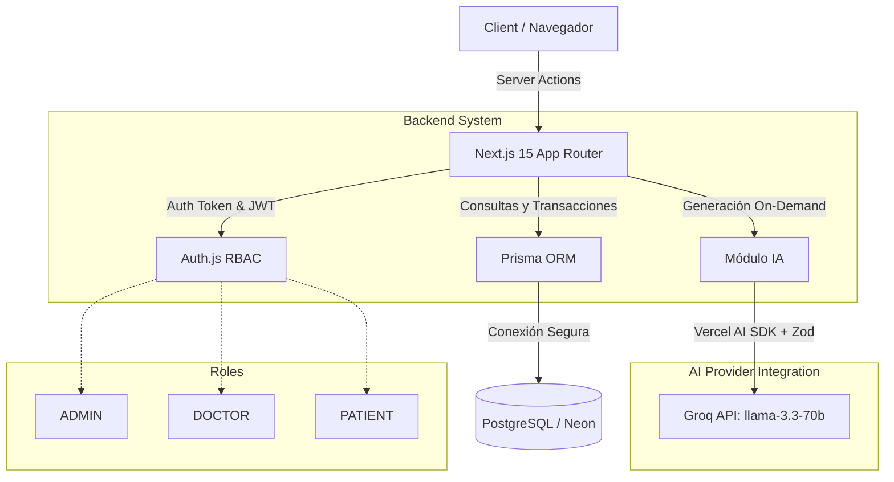

# MediTurnos

MediTurnos es una plataforma moderna para la gestión eficiente de turnos médicos. Está diseñada para administradores, médicos y pacientes, ofreciendo un control de agenda estricto, mitigación de colisiones de turnos mediante transacciones atómicas e integración de Inteligencia Artificial para comunicación proactiva y personalizada con los pacientes.

## 🚀 Tecnologías

- **Framework**: Next.js 15 (App Router)
- **Base de Datos**: PostgreSQL (Neon)
- **ORM**: Prisma (Prisma Client + Prisma Studio)
- **Autenticación**: Auth.js (NextAuth v5) con estrategia JWT
- **UI & Estilos**: Tailwind CSS, shadcn/ui, Recharts, Lucide Icons
- **IA**: Vercel AI SDK + Groq SDK (`llama-3.3-70b-versatile`) con validaciones Zod
- **Testing y CI**: Vitest, vitest-mock-extended, GitHub Actions

## 🏗️ Arquitectura del Sistema

La arquitectura sigue el patrón de Server Actions y Client Components en Next.js, apoyándose fuertemente en Prisma para las transacciones seguras de base de datos y Auth.js para control de acceso (RBAC) descentralizado.

## 📊 Diagrama de Arquitectura (Mermaid)



## 🛠️ Instalación Local

1. Clonar el repositorio.
2. Navegar a la carpeta del proyecto y ejecutar:
   ```bash
   npm install
   ```
3. Configurar el archivo `.env` (ver sección Variables de Entorno).
4. Sincronizar Prisma y levantar base de datos:
   ```bash
   npx prisma generate
   npx prisma migrate dev
   npx prisma db seed
   ```
5. Iniciar el servidor local:
   ```bash
   npm run dev
   ```

## 🔐 Variables de Entorno

Crear un archivo `.env` tomando como referencia `.env.example`. Variables requeridas:

- `DATABASE_URL`: URI de conexión a la base PostgreSQL.
- `AUTH_SECRET`: Llave secreta para firmar los JWT de Auth.js (Mínimo 32 caracteres).
- `NEXTAUTH_URL`: URL base de la aplicación (ej. `http://localhost:3000`).
- `AI_PROVIDER`: Proveedor de IA (por defecto `groq`).
- `GROQ_API_KEY`: Clave de API provista por Groq Console.
- `DEFAULT_TIMEZONE`: Zona horaria a utilizar para los cálculos lógicos (ej. `America/Argentina/Mendoza`).
- `CANCELLATION_MIN_HOURS`: Regla de negocio para determinar cuantas horas de anticipación son obligatorias para cancelar un turno (ej. `2`).

## 🌱 Seed de Datos

Al correr el comando `npx prisma db seed`, la base de datos se poblará automáticamente con perfiles para pruebas inmediatas. 
Todas las contraseñas para los usuarios del seed son: `password123`

- **Administrador**: `admin@mediturnos.com`
- **Médico (Cardiología)**: `doctor@mediturnos.com`
- **Paciente**: `patient@mediturnos.com`

## 🧪 Ejecución de Tests

La suite completa está 100% mockeada (no depende de DB local ni Groq) para garantizar rapidez en el CI/CD:
```bash
npm run test
```

## 🚀 Despliegue (Vercel + Neon)

Para llevar este proyecto a producción:
1. Crear una base de datos en **Neon** (PostgreSQL Serverless) y copiar el Connection String.
2. Enlazar el repositorio de GitHub en **Vercel**.
3. En la configuración de Vercel (Sección Environment Variables), cargar:
   - `DATABASE_URL` (Directo a Neon).
   - `AUTH_SECRET` (Generar una nueva llave de 32 caracteres).
   - `GROQ_API_KEY` (Token de producción).
   - *Nota*: Vercel auto-configura variables para NextAuth si no existe un dominio personalizado, por lo que `NEXTAUTH_URL` puede omitirse.
4. En los **Build Settings** de Vercel, asegurar el comando de Install incluya generación de cliente: `npm install && npx prisma generate`.
5. Ejecutar despliegue.

## 🤖 Uso de Inteligencia Artificial

El sistema integra un Módulo de IA *On-Demand* que automatiza las notificaciones a los pacientes frente a eventos atípicos o transiciones de estado.
El sistema invoca a la API de Groq usando `llama-3.3-70b-versatile` combinado con el Vercel AI SDK. Las salidas son validadas con `zod` para evitar alucinaciones, y los registros se insertan silenciosamente en una bitácora `AIInteraction` sin pausar la UX ni requerir costosos Jobs asíncronos.

## 👤 Autor

Desarrollado y mantenido asistidamente bajo directrices de requerimientos avanzados de agentes AI (Antigravity). 
