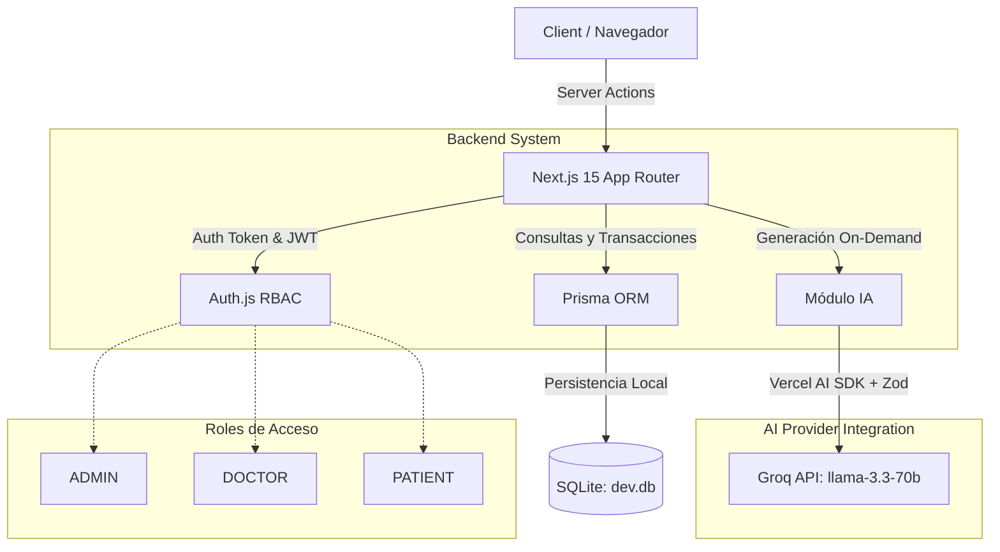

# 🏥 MediTurnos — Sistema de Gestión de Turnos Médicos

MediTurnos es una plataforma moderna e integrada para la gestión eficiente de turnos médicos, diseñada para optimizar los flujos de trabajo de administradores, médicos y pacientes. El sistema implementa un control de agenda estricto, mitigación de colisiones de turnos mediante transacciones atómicas de base de datos e integración profunda de Inteligencia Artificial para la comunicación proactiva y personalizada.

---

## 🚀 Tecnologías e IA Asistente 

Este proyecto fue diseñado y ejecutado bajo un enfoque de **Desarrollo Ágil Asistido por IA**, utilizando modelos fundacionales avanzados tanto en el proceso de ingeniería de software (co-piloto de desarrollo) como en las reglas de negocio del dominio de aplicación.

### 🤖 Arsenal de IA y Herramientas Asistentes
* * **IA de Cátedra / Co-piloto de Desarrollo**: **Gemini 2.5 Pro** (vía el agente autónomo **Antigravity** integrado en el entorno de **Open Design CLI**), utilizado estratégicamente en la planificación de la arquitectura, generación de código de extremo a extremo, diagnóstico de errores en middlewares y armado de la suite de testing.
* **IA de Dominio (En la Aplicación)**: **Vercel AI SDK** combinado con el servicio de Groq API corriendo el modelo de código abierto de alto rendimiento **`llama-3.3-70b-versatile`**.

### 🛠️ Stack Tecnológico Base
- **Framework**: Next.js 15 (App Router)
- **Base de Datos**: SQLite
- **ORM**: Prisma (Prisma Client + Prisma Studio)
- **Autenticación**: Auth.js (NextAuth v5) con estrategia JWT
- **UI & Estilos**: Tailwind CSS, shadcn/ui, Recharts, Lucide Icons
- **Testing y CI**: Vitest, vitest-mock-extended, GitHub Actions

## 🏗️ Arquitectura del Sistema

La solución adopta un patrón arquitectónico desacoplado pero cohesivo, donde Next.js actúa como el núcleo orquestador. Las interacciones de la base de datos se ejecutan en el servidor mediante *Server Actions*, blindando la lógica de negocio del lado del cliente.

### 📊 Diagrama de Arquitectura (Mermaid)



## 🛠️ Instalación Local

1. Clonar el repositorio.
2. Navegar a la carpeta del proyecto y ejecutar:
   ```bash
   npm install
   ```
3. Encender el sistema:
   ```bash
   npm run dev
   ```
4. Abra el navegador e ingresar a la siguiente dirección: http://localhost:3000

## 🌱 Seed de Datos

La base de datos se puebla automáticamente durante el paso 2 con tres perfiles configurados para auditar el Control de Acceso Basado en Roles (RBAC).
Todas las contraseñas para los usuarios del seed son: `password123`

- **Administrador**: `admin@mediturnos.com`
- **Médico (Cardiología)**: `doctor@mediturnos.com`
- **Paciente**: `patient@mediturnos.com`

## 🧪 Ejecución de Tests

La suite completa está 100% mockeada (no depende de DB local ni Groq) para garantizar rapidez en el CI/CD:
```bash
npm run test
```


## 🤖 Uso de Inteligencia Artificial

El sistema integra un Módulo de IA *On-Demand* que automatiza las notificaciones a los pacientes frente a eventos atípicos o transiciones de estado.
El sistema invoca a la API de Groq usando `llama-3.3-70b-versatile` combinado con el Vercel AI SDK. Las salidas son validadas con `zod` para evitar alucinaciones, y los registros se insertan silenciosamente en una bitácora `AIInteraction` sin pausar la UX ni requerir costosos Jobs asíncronos.

